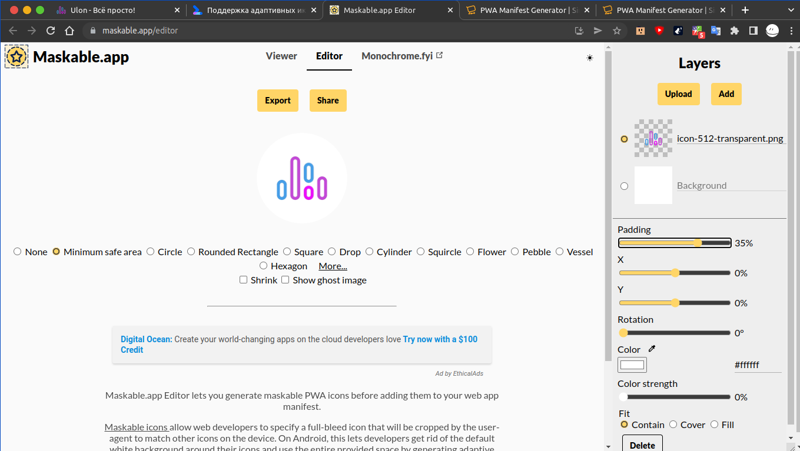

# Ulon
It is  Ulon's test site. Hi dank!

## Help
+ [manifest and icons generator ](https://www.simicart.com/manifest-generator.html/)
+ [maskable icons generator](https://maskable.app/editor)
+ 
+ [screens for ios generator](https://appsco.pe/developer/splash-screens)
+ [instruction for generator of screens](https://www.simicart.com/blog/pwa-splash-screen/?simipwa=1)

## register

### Advises
+ проверять прав на файлы и папки
+ проверять пути
+ в json или еще где-то проверять правильность полей

26.05.22 была ошибка `Uncaught (in promise) TypeError: Failed to execute 'addAll' on 'Cache': Request failed` (также если не получается достучаться до файла по заданному пути )

погуглил , там написали что нужно проверить на всех ли файлах которые я хочу кэшировать есть ответ 200
я начал смотреть все файлы в браузере (url сайта + путь к файлу) через некоторое время я понял что нудно поменять права на файлы и папки
права на файл не ниже 644 , на папку 755 если выше то вроде ничего срашного 